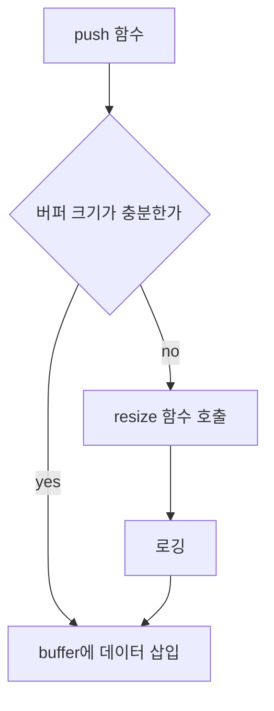

# RingBuffer
기본적인 링버퍼 구현

## 기능
- 버퍼에 대한 기본적인 push, front, pop
- 직접적인 버퍼 접근
- 재할당

## 버퍼에 대한 기본적인 push, front, pop
- push
  > ```
  > CRingBuffer buffer;
  > buffer.pushBuffer(5, "12345");
  > ```
  > pushBuffer는 소스 코드 라인과 파일 이름을 넘기기위한 매크로이다.
  > 원래 함수는 _pushBuffer(size, buffer,  line, fileName)의 형식이다.
  > 넘겨받은 소스 코드 관련 내용은 재할당할 때 로깅하여 추적하기 위함이다.
- front
  > ```
  > CRingBuffer buffer;
  > char destBuffer[5];
  > buffer.frontBuffer(5, destBuffer);
  > ```
  > 링버퍼 내부의 데이터를 외부 버퍼로 복사하는 함수이다.
  > front 변수를 변경하지 않는다.
- pop
  > ```
  > CRingBuffer buffer;
  > buffer.popBuffer(5);
  > ```
  > 링버퍼의 front 변수를 증가시킨다.

## 직접적인 버퍼 접근
직접적으로 내부 버퍼에 접근할 수 있도록 함수를 제공한다.
안정성을 생각하면 존재해서는 안되는 기능이지만, 성능 향상을 목적으로 사용한다.

- getDirectRear, getDirectFront
  > rear와 front가 가르키고 있는 버퍼의 포인터(char*)를 리턴한다.
- getDirectFreeSize
  > 현재 rear에서 버퍼의 끝 혹은 front까지 memcpy를 통해 삽입가능한 버퍼의 크기를 의미한다.
  > 현재 버퍼가 비어있더라도 rear가 버퍼의 끝 쪽에 있다면 크기가 적게 반환된다.
- moveRear, moveFront
  > 직접적으로 rear, front에 접근하는 함수이다.

```
CRingBuffer buffer;

char* directRear = buffer.getDirectRear();
int directFreeSize = buffer.getDirectFreeSize();

if(directFreeSize >= 5){
   memcpy(directRear, 5, "12345");
   buffer.moveRear(5);
}
```

## 재할당
재할당은 pushBuffer 함수 내부에서 자동으로 이루어진다.
push를 해야하는데 buffer가 모자라다면 buffer를 재할당하고 push 작업을 진행한다.

