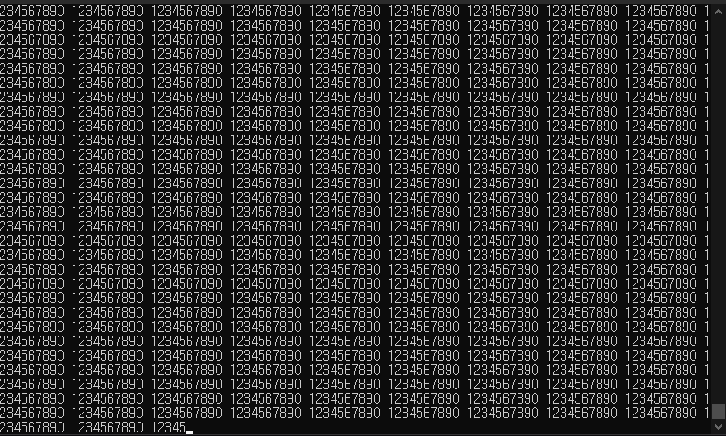
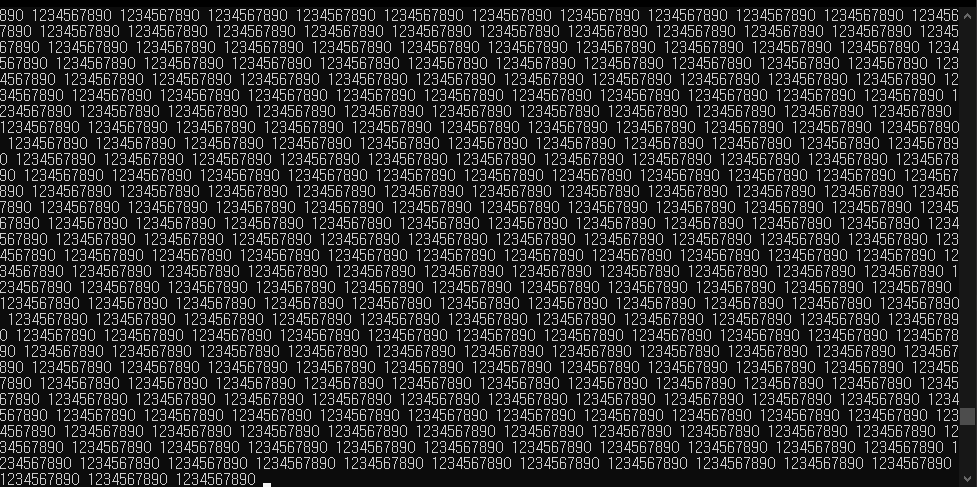

# RingBuffer Test
링버퍼 테스트 프로젝트이다.

## 어떻게 테스트할 것인가
- 준비한 문자열을 저장한다.
- 저장된 문자열을 랜덤한 길이로 획득한다.
- 출력한다.
- 만약 링버퍼에 문제가 있다면 중간에 끊기거나 여러 번 출력될 것이다.

## 중간에 끊기는 구간 판단하기
콘솔창의 크기를 잘 맞추면, 출력되는 문자열이 반듯하게 출력되는 것을 확인할 수 있다.  
도중에 길이가 맞지 않는 문자열이 출력되면, 줄바꿈이 기존과 다른 곳에서 발생할 것이고  
결과적으로 반듯했던 문자열이 틀어지게 된다.  
이 틀어짐이 발생하면 문제가 있는 것으로 판단하였다.  

- 정상적인 상황
   >  
- 비정상적인 상황
   >   

 